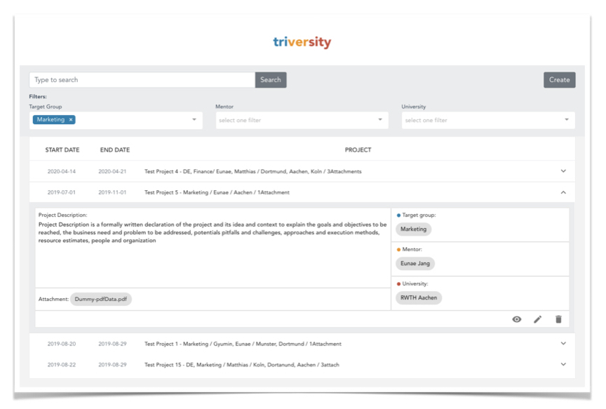

This app is used internally at trivago to manage our collaborations with Universities.  
It was built as part of the [trivago Tech Camp 2019](https://techcamp.trivago.com/) by
@eajang and @GyuminLee.

## Screenshot



## Requirements

* [Airtable] account (for data storage)
* [Filestack] account (for file uploads)

## Setup

To run this application you need an Airtable token.
Get the token from [here](https://airtable.com/api).

You also need a [FileStack token](https://dev.filestack.com/signup/free/).

Create an `.env` file with your credentials:

```
VUE_APP_AIRTABLE_API_KEY=xxxxxxxxxxxxx
VUE_APP_AIRTABLE_API_BASE=xxxxxxxxxxxxx
VUE_APP_FILESTACK_API_KEY=xxxxxxxxxxxxx
```

## Build Setup

``` bash
# install dependencies
npm install

# serve with hot reload at localhost:8080
npm run dev

# build for production with minification
npm run build

# build for production and view the bundle analyzer report
npm run build --report
```

For a detailed explanation on how things work, check out the [guide](http://vuejs-templates.github.io/webpack/) and [docs for vue-loader](http://vuejs.github.io/vue-loader).

[Airtable]: https://airtable.com/ 
[Filestack ]: https://www.filestack.com/ 
